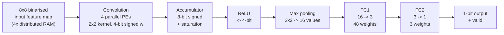

# Quantised CNN Inference Accelerator (SystemVerilog / Artix-7)

A hand-written CNN inference accelerator for the Digilent Nexys4 DDR
(Xilinx Artix-7 `xc7a100tcsg324-1`), implemented in SystemVerilog.

Binarised activations and 4-bit signed weights let every multiply–accumulate
collapse into a select-and-add, so **the whole network runs without a single
DSP slice or Block RAM** — it fits in 3% of the fabric LUTs and closes timing
at 100 MHz.

| | |
|---|---|
| **Target** | Nexys4 DDR — Artix-7 `xc7a100tcsg324-1` |
| **Toolchain** | Vivado 2024.1 |
| **Clock** | 100 MHz (10 ns), timing met, WNS **+0.168 ns** |
| **Logic** | 1901 LUTs (3.00%), 558 FFs (0.44%) |
| **Hard blocks** | **0 DSPs**, **0 BRAMs** |
| **Language** | SystemVerilog (~1750 lines, 12 RTL modules) |

---

## Why zero DSPs

Activations are binarised to 1 bit and weights quantised to 4-bit signed. A
multiply is therefore `pixel ? weight : 0` — a mux, not a multiplier — and the
processing element reduces to a 4-input adder tree with saturation:

```systemverilog
window_bits = (start_pe && (count_PE <= 8'd60)) ? ifmap[count_PE +: 4] : 4'b0;
mult0 = window_bits[0] ? weights[0] : 8'sd0;   // 1-bit activation gates the weight
mult1 = window_bits[1] ? weights[1] : 8'sd0;
mult2 = window_bits[2] ? weights[2] : 8'sd0;
mult3 = window_bits[3] ? weights[3] : 8'sd0;
acc_sum = mult0 + mult1 + mult2 + mult3;
```

All 240 DSP slices and all 135 BRAMs on the device stay free. Weight and
feature-map storage uses LUT-based distributed RAM (256 LUTs configured as
memory), leaving the hard blocks available for whatever else shares the chip.

---

## Architecture



Data flows as a valid-qualified stream between stages; each stage signals its
successor rather than running off a global schedule.

### Modules

| File | Role |
|---|---|
| `rtl/PE.sv` | Processing element — 4-tap MAC, 1-bit activations x 4-bit signed weights, saturating to 8-bit |
| `rtl/PE_TOP.sv` | Four PEs in parallel with shared window addressing |
| `rtl/Acc.sv` | Partial-sum accumulation across sliding-window positions |
| `rtl/CONV_Controller.sv` | Convolution sequencing — window position, memory addressing, handshakes |
| `rtl/conv_top.sv` | Convolution stage: PEs + accumulator + ReLU + memory glue |
| `rtl/RELU_v1.sv` | ReLU, 8-bit signed to 4-bit unsigned |
| `rtl/Pooling_TOP.sv` | 2x2 max pooling, streaming, 4-value row registers |
| `rtl/FC_TOP.sv` | Both fully-connected layers, weight shift-in, 16-value input buffer |
| `rtl/RAM_IP_TOP.sv` | Wrapper around four 16x64 distributed-RAM instances |
| `rtl/network_top.sv` | Wires conv -> pool -> FC into the network datapath |
| `rtl/top.sv` | Board-level top: start-pulse FSM, output registering |
| `rtl/top_initialize.sv` | Weight/feature-map load sequencing at reset |
| `tb/tb_top.sv` | Testbench (see *Verification status* — this is currently a smoke test) |

---

## Results

Taken from the routed implementation run (Vivado 2024.1).

### Timing — 100 MHz, met

| Metric | Value |
|---|---|
| WNS (setup) | **+0.168 ns** |
| WHS (hold) | +0.154 ns |
| WPWS (pulse width) | +3.750 ns |
| Failing endpoints | 0 / 1986 |
| Router | 2297 / 2297 nets routed, 0 routing errors |

Vivado reports *"All user specified timing constraints are met."*

The 0.168 ns of setup slack is **1.7% of the clock period** — it closes, but
it is not comfortable. The critical path runs through the accumulator; pushing
meaningfully past 100 MHz would need that path pipelined.

### Utilisation

| Resource | Used | Available | % |
|---|---|---|---|
| Slice LUTs | 1901 | 63400 | 3.00 |
| — as logic | 1645 | 63400 | 2.59 |
| — as memory | 256 | 19000 | 1.35 |
| Slice registers | 558 | 126800 | 0.44 |
| F7 muxes | 30 | 31700 | 0.09 |
| F8 muxes | 15 | 15850 | 0.09 |
| **DSPs** | **0** | 240 | **0.00** |
| **Block RAM** | **0** | 135 | **0.00** |
| Bonded IOB | 5 | 210 | 2.38 |

---

## Verification status

**Being straight about this: `tb/tb_top.sv` is a smoke test, not a
verification suite.** It drives reset, pulses `start`, and lets the design run.
It contains no assertions, no golden reference, and no pass/fail report — so it
demonstrates that the design elaborates, simulates and builds, and nothing more
than that.

Functional correctness of the network output is therefore **not** established
by anything in this repository. It is the top item on the roadmap below.

---

## Rebuilding

Requires Vivado 2024.1 and a Nexys4 DDR board.

The four `dist_mem_gen` distributed-RAM cores are **Xilinx IP and are not
redistributed here.** Regenerate them through the IP catalog before building:

| Instance | Configuration |
|---|---|
| `dist_mem_gen_0` .. `dist_mem_gen_3` | Distributed Memory Generator, **single-port RAM**, depth **16**, data width **64** |

Each instance is initialised from a `.coe` memory-initialisation file — see
*What is deliberately not here*.

```tcl
# from the repo root
vivado -mode batch -source scripts/create_project.tcl
```

The script creates the project, adds the RTL, testbench and constraints, and
sets `top` as the top module. Add the four regenerated IP cores and your
`.coe` files, then run synthesis and implementation.

---

## What is deliberately not here

This design was developed in an environment covered by a non-disclosure
agreement. The following are excluded on purpose, and `.gitignore` is
deny-by-default so they cannot be added by accident:

- **Xilinx IP cores** (`dist_mem_gen_*`) and all generated output products —
  licensed IP, regenerable from the parameters above.
- **The Vivado project, run and simulation directories** — these embed
  absolute filesystem paths and the originating account ID.
- **`.coe` memory-initialisation files** — the trained weights and test
  images. Withheld pending confirmation that this data is not covered by the
  NDA. Without them the design builds but has nothing to infer on.

---

## Roadmap

- [ ] **Self-checking testbench** — golden reference model, per-layer
      comparison, explicit pass/fail
- [ ] Constrain `output_ext` / `valid_output_ext` to real pins (currently
      auto-placed by the tool)
- [ ] Pipeline the accumulator critical path to lift the 100 MHz ceiling
- [ ] Publish the training / quantisation flow that produces the `.coe` files
- [ ] Report measured throughput in inferences/sec

---

## Usage

No licence is granted. This repository is published for portfolio and
reference purposes; all rights are reserved by the author. Please get in touch
before reusing any of it.

`constraints/nexys4_constraints.xdc` is Digilent's generic Nexys4 board
template and remains subject to Digilent's own terms.
