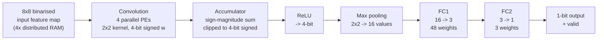

# Quantised CNN Inference Accelerator (SystemVerilog / Artix-7)

A hand-written CNN inference accelerator for the Digilent Nexys4 DDR
(Xilinx Artix-7 `xc7a100tcsg324-1`), implemented in SystemVerilog.

Binarised activations and 4-bit signed weights let every multiply–accumulate
collapse into a select-and-add, so **the whole network runs without a single
DSP slice or Block RAM** — it fits in 3% of the fabric LUTs and closes timing
at 100 MHz.

| | |
|---|---|
| **Target** | Nexys4 DDR — Artix-7 `xc7a100tcsg324-1` |
| **Toolchain** | Vivado 2024.1 |
| **Clock** | 100 MHz (10 ns), timing met, WNS **+0.168 ns** |
| **Logic** | 1901 LUTs (3.00%), 558 FFs (0.44%) |
| **Hard blocks** | **0 DSPs**, **0 BRAMs** |
| **Language** | SystemVerilog (12 RTL modules) |

---

## Why zero DSPs

Activations are binarised to 1 bit and weights quantised to 4-bit signed. A
multiply is therefore `pixel ? weight : 0` — a mux, not a multiplier — and the
processing element reduces to a 4-input adder tree with saturation:

```systemverilog
window_bits = (start_pe && (count_PE <= 8'd60)) ? ifmap[count_PE +: 4] : 4'b0;
mult0 = window_bits[0] ? weights[0] : 8'sd0;   // 1-bit activation gates the weight
mult1 = window_bits[1] ? weights[1] : 8'sd0;
mult2 = window_bits[2] ? weights[2] : 8'sd0;
mult3 = window_bits[3] ? weights[3] : 8'sd0;
acc_sum = mult0 + mult1 + mult2 + mult3;
```

All 240 DSP slices and all 135 BRAMs on the device stay free. Weight and
feature-map storage uses LUT-based distributed RAM (256 LUTs configured as
memory), leaving the hard blocks available for whatever else shares the chip.

---

## Architecture



Data flows as a valid-qualified stream between stages; each stage signals its
successor rather than running off a global schedule.

### Modules

| File | Role |
|---|---|
| `rtl/PE.sv` | Processing element — 4-tap MAC, 1-bit activations x 4-bit signed weights, registered 8-bit signed result |
| `rtl/PE_TOP.sv` | Four PEs in parallel with shared window addressing |
| `rtl/Acc.sv` | Partial-sum accumulation across sliding-window positions |
| `rtl/CONV_Controller.sv` | Convolution sequencing — window position, memory addressing, handshakes |
| `rtl/conv_top.sv` | Convolution stage: PEs + accumulator + ReLU + memory glue |
| `rtl/RELU_v1.sv` | ReLU, 8-bit signed to 4-bit unsigned |
| `rtl/Pooling_TOP.sv` | 2x2 max pooling, streaming, 4-value row registers |
| `rtl/FC_TOP.sv` | Both fully-connected layers, weight shift-in, 16-value input buffer |
| `rtl/RAM_IP_TOP.sv` | Wrapper around four 16x64 distributed-RAM instances |
| `rtl/network_top.sv` | Wires conv -> pool -> FC into the network datapath |
| `rtl/top.sv` | Board-level top: start-pulse FSM, output registering |
| `rtl/top_initialize.sv` | Weight/feature-map load sequencing at reset |
| `tb/` | Five self-checking testbenches + behavioural RAM models — see *Verification* |

---

## Results

Taken from the routed implementation run (Vivado 2024.1).

### Timing — 100 MHz, met

| Metric | Value |
|---|---|
| WNS (setup) | **+0.168 ns** |
| WHS (hold) | +0.154 ns |
| WPWS (pulse width) | +3.750 ns |
| Failing endpoints | 0 / 1986 |
| Router | 2297 / 2297 nets routed, 0 routing errors |

Vivado reports *"All user specified timing constraints are met."*

The 0.168 ns of setup slack is **1.7% of the clock period** — it closes, but
it is not comfortable. The critical path runs through the accumulator; pushing
meaningfully past 100 MHz would need that path pipelined.

### Utilisation

| Resource | Used | Available | % |
|---|---|---|---|
| Slice LUTs | 1901 | 63400 | 3.00 |
| — as logic | 1645 | 63400 | 2.59 |
| — as memory | 256 | 19000 | 1.35 |
| Slice registers | 558 | 126800 | 0.44 |
| F7 muxes | 30 | 31700 | 0.09 |
| F8 muxes | 15 | 15850 | 0.09 |
| **DSPs** | **0** | 240 | **0.00** |
| **Block RAM** | **0** | 135 | **0.00** |
| Bonded IOB | 5 | 210 | 2.38 |

---

## Verification

Five self-checking testbenches. Each compares the DUT against an independent
reference model and prints an explicit `RESULT: PASS` / `RESULT: FAIL`; the
runner exits non-zero on any failure, so it drops straight into CI.

```bash
./scripts/run_sim.sh          # all testbenches
./scripts/run_sim.sh tb_pe    # just one
```

Uses Vivado's `xsim` if present, otherwise Icarus Verilog. **No IP generation
is needed** — `tb/dist_mem_gen_model.sv` provides behavioural stand-ins for the
four distributed-RAM cores, so the suite runs without invoking Vivado and
without the `.coe` files the real cores expect.

| Testbench | Scope | Method |
|---|---|---|
| `tb_relu.sv` | `RELU_v1` | **Exhaustive** — all 32 reachable input states |
| `tb_pe.sv` | `PE` | Directed edge cases + all 61 window positions + 2000 randomised, against an independent reference |
| `tb_acc.sv` | `Acc` | Directed clipping/cancellation cases + 4000 randomised; reference computes the plain signed sum, so it checks the sign-magnitude implementation rather than restating it |
| `tb_pooling.sv` | `Pooling_TOP` | Full 15-row frame, per-bin maximum scoreboard, output-count and range properties |
| `tb_top.sv` | `top` | Protocol and liveness: clean reset, response to `start`, bounded-time valid, no X/Z on outputs |

### What is still not proven

`tb_top.sv` deliberately does **not** check the classification result. The
trained weights and test images live in the `.coe` files, which are not in this
repository, so there is nothing to infer on and no golden output to compare
against. Numerical end-to-end correctness is therefore still open, and is the
top roadmap item.

### Known issue: pooling bin boundaries

`tb_pooling.sv` documents a discrepancy it found in `Pooling_TOP`. The four
accumulation bins are not uniform:

| Bin | Accumulates `count_PE` | Positions | Emitted at |
|---|---|---|---|
| 1 | 0–15 | 16 | 16 |
| 2 | 16–30 | 15 | 32 |
| 3 | 31–45 | 15 | 48 |
| 4 | 46–60 | 15 | 60 |

Bin 1 covers one more position than the others, and bins 2 and 3 stop
accumulating well before the point at which they are emitted — so positions 31
and 32 fall into bin 3 even though bin 2 has not yet been read out. The RTL
also writes bin 4's lower bound as `>= 45` while bin 3 already claims 45; the
`if`/`else if` chain resolves that in bin 3's favour, so nothing is
double-counted, but it looks like a typo for 46.

The testbench encodes the behaviour **as implemented**, so it passes and works
as a regression test, and raises warnings pointing at the boundaries. If the
intent was uniform 2×2 pooling, the RTL needs a fix and the testbench
parameters need to follow.

---

## Rebuilding

Requires Vivado 2024.1 and a Nexys4 DDR board.

```tcl
# from the repo root
vivado -mode batch -source scripts/create_project.tcl
```

The script creates the project, adds the RTL, testbenches, constraints and the
four IP cores, and sets `top` as the top module.

### IP cores

`ip/dist_mem_gen_{0..3}/` contains the Vivado IP configurations — stock
Distributed Memory Generator instances, **single-port RAM, depth 16, data
width 64**. Vivado regenerates the cores from these `.xci` files on first
build; the generated output products are not committed, since they are
derived and embed build-machine paths.

Each core is initialised from a `.coe` memory-initialisation file
(`img_00026_ram0..3.coe`). **Those files are not in this repository** — see
below — so IP generation will report a missing coefficient file until they are
supplied. Point each core at your own `.coe`, or clear the initialisation
field to build with zeroed memory.

---

## What is deliberately not here

`.gitignore` is deny-by-default, so nothing reaches the repository unless it
has been explicitly allowed:

- **Generated IP output products** — regenerable from the committed `.xci`
  files, and they embed build-machine paths.
- **The Vivado project, run and simulation directories** — these embed
  absolute filesystem paths and the originating account ID.
- **`.coe` memory-initialisation files** — the trained weights and test
  images. Without them the design builds but has nothing to infer on, and IP
  generation will flag the missing coefficient files.

---

## Roadmap

- [ ] **End-to-end golden reference** — behavioural model of the quantised
      network, compared against the hardware output bit (needs the `.coe` data)
- [ ] Resolve the pooling bin boundaries documented above
- [ ] Constrain `output_ext` / `valid_output_ext` to real pins (currently
      auto-placed by the tool)
- [ ] Pipeline the accumulator critical path to lift the 100 MHz ceiling
- [ ] Publish the training / quantisation flow that produces the `.coe` files
- [ ] Report measured throughput in inferences/sec

---

## Usage

No licence is granted. This repository is published for portfolio and
reference purposes; all rights are reserved by the author. Please get in touch
before reusing any of it.

`constraints/nexys4_constraints.xdc` is Digilent's generic Nexys4 board
template and remains subject to Digilent's own terms.
