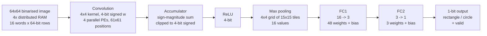

# Quantised CNN Inference Accelerator (SystemVerilog / Artix-7)

A hand-written CNN inference accelerator for the Digilent Nexys4 DDR
(Xilinx Artix-7 `xc7a100tcsg324-1`), implemented in SystemVerilog.

The network is a binary shape classifier: it takes a 64×64 black-and-white
image and answers **rectangle or circle** on a single output pin.

Binarised activations and 4-bit signed weights let every multiply–accumulate
collapse into a select-and-add, so **the whole network runs without a single
DSP slice or Block RAM** — it fits in 3% of the fabric LUTs and closes timing
at 100 MHz.

| | |
|---|---|
| **Target** | Nexys4 DDR — Artix-7 `xc7a100tcsg324-1` |
| **Toolchain** | Vivado 2024.1 |
| **Clock** | 100 MHz (10 ns), timing met, WNS **+0.168 ns** |
| **Logic** | 1901 LUTs (3.00%), 558 FFs (0.44%) |
| **Hard blocks** | **0 DSPs**, **0 BRAMs** |
| **Network** | 64×64 binary image → 4×4 conv → ReLU → max pool → FC 16→3 → FC 3→1 |
| **Language** | SystemVerilog — 1691 lines of RTL in 12 modules, 840 lines of testbench |

---

## Why zero DSPs

Activations are binarised to 1 bit and weights quantised to 4-bit signed. A
multiply is therefore `pixel ? weight : 0` — a mux, not a multiplier — and the
processing element reduces to a 4-input adder tree:

```systemverilog
window_bits = (start_pe && (count_PE <= 8'd60)) ? ifmap[count_PE +: 4] : 4'b0;
mult0 = window_bits[0] ? weights[0] : 8'sd0;   // 1-bit activation gates the weight
mult1 = window_bits[1] ? weights[1] : 8'sd0;
mult2 = window_bits[2] ? weights[2] : 8'sd0;
mult3 = window_bits[3] ? weights[3] : 8'sd0;
acc_sum = mult0 + mult1 + mult2 + mult3;
```

Four 4-bit signed weights sum to at most `4 × [-8, 7] = [-32, 28]`, which is
why the 8-bit accumulator needs no saturation logic — the range cannot
overflow it.

All 240 DSP slices and all 135 BRAMs on the device stay free. Feature-map
storage uses LUT-based distributed RAM (256 LUTs configured as memory),
leaving the hard blocks available for whatever else shares the chip.

---

## Architecture



Data flows as a valid-qualified stream between stages; each stage signals its
successor rather than running off a global schedule.

### How the 4×4 window is fed

The image is stored row-interleaved across the four distributed RAMs: row `r`
lives in RAM `r mod 4` at address `r div 4`, so 4 RAMs × 16 words covers all
64 rows. Each RAM word is one full 64-pixel row.

On every vertical step `CONV_Controller` drives `count_def = v_pos[1:0]`, and
`RAM_IP_TOP` barrel-rotates its four outputs by that amount. The four PEs
therefore always see rows `r, r+1, r+2, r+3` in order, whichever RAM each one
physically came from. Each PE slices 4 horizontally-adjacent pixels with
`ifmap[count_PE +: 4]`, so the four PEs together cover a **4×4 window**, and
the 16 filter taps are split 4-per-PE.

Sweeping `count_PE` 0…60 horizontally and `v_pos` 0…60 vertically gives the
61×61 valid-convolution output of a 4×4 kernel on a 64×64 image.

### Modules

| File | Role |
|---|---|
| `rtl/PE.sv` | Processing element — 4-tap MAC, 1-bit activations × 4-bit signed weights, registered 8-bit signed result |
| `rtl/PE_TOP.sv` | Four PEs in parallel; holds the 16 conv weights and distributes 4 to each PE |
| `rtl/Acc.sv` | Sums the four PE partial sums in sign-magnitude form, clips to 4-bit signed |
| `rtl/CONV_Controller.sv` | Convolution sequencing — window position, RAM addressing, rotation phase, handshakes |
| `rtl/conv_top.sv` | Convolution stage: controller + RAM + PEs + accumulator + ReLU |
| `rtl/RELU_v1.sv` | ReLU — 4-bit signed in, 4-bit unsigned out; also instantiated ×3 inside `FC_TOP` |
| `rtl/Pooling_TOP.sv` | Streaming max pooling into 4 bins × 15 rows → 16 values per frame |
| `rtl/FC_TOP.sv` | Both fully-connected layers, weight shift-in, 16-value input buffer, biases |
| `rtl/RAM_IP_TOP.sv` | Four 16×64 distributed-RAM instances plus the barrel rotation described above |
| `rtl/network_top.sv` | Wires conv → pool → FC into the network datapath |
| `rtl/top.sv` | Board-level top: start-pulse FSM, output latching |
| `rtl/top_initialize.sv` | Weight ROMs and the load FSMs that shift them into the datapath at start |
| `tb/` | Five self-checking testbenches + behavioural RAM models — see *Verification* |
| `MATLAB/` | Golden reference model of the same network — see *MATLAB reference model* |

### Where the weights live

All trained parameters are **hardcoded in the RTL**, not loaded from external
files:

| Parameter | Count | Location |
|---|---|---|
| Conv filter | 16 (4×4) | `rom_mem_fin` in `top_initialize.sv` |
| FC1 weights | 48 (3 × 4×4) | `rom_mem_fc1` in `top_initialize.sv` |
| FC2 weights | 3 | `rom_mem_fc2` in `top_initialize.sv` |
| FC1 biases | 3 (−12, +20, +24) | constants in `FC_TOP.sv` |
| FC2 bias | 1 (+6) | constant in `FC_TOP.sv` |

`top_initialize.sv` shifts them into `PE_TOP` and `FC_TOP` over a nibble-wide
bus at start-up, then pulses `start_read` to begin inference.

The only thing loaded from `.coe` files is the **input image** — see
*IP cores* below.

---

## Results

Taken from the routed implementation run (Vivado 2024.1).

### Timing — 100 MHz, met

| Metric | Value |
|---|---|
| WNS (setup) | **+0.168 ns** |
| WHS (hold) | +0.154 ns |
| WPWS (pulse width) | +3.750 ns |
| Failing endpoints | 0 / 1986 |
| Router | 2297 / 2297 nets routed, 0 routing errors |

Vivado reports *"All user specified timing constraints are met."*

The 0.168 ns of setup slack is **1.7% of the clock period** — it closes, but
it is not comfortable. The critical path runs through the accumulator; pushing
meaningfully past 100 MHz would need that path pipelined.

### Utilisation

| Resource | Used | Available | % |
|---|---|---|---|
| Slice LUTs | 1901 | 63400 | 3.00 |
| — as logic | 1645 | 63400 | 2.59 |
| — as memory | 256 | 19000 | 1.35 |
| Slice registers | 558 | 126800 | 0.44 |
| F7 muxes | 30 | 31700 | 0.09 |
| F8 muxes | 15 | 15850 | 0.09 |
| **DSPs** | **0** | 240 | **0.00** |
| **Block RAM** | **0** | 135 | **0.00** |
| Bonded IOB | 5 | 210 | 2.38 |

---

## MATLAB reference model

`MATLAB/` holds the model the hardware was written against — the algorithm
expressed directly, with no notion of cycles, memory layout or bit widths.
Every parameter in it matches the RTL exactly:

| MATLAB | RTL | Agrees |
|---|---|---|
| `run_cnn.m` 4×4 `convolution_filter` | `rom_mem_fin` (`top_initialize.sv`) | ✅ all 16 taps |
| `fully_connect.m` `fc_filter1..3` | `rom_mem_fc1` | ✅ all 48 weights |
| `fully_connect.m` `fc_filter4` | `rom_mem_fc2` | ✅ `[-8 7 7]` |
| Biases `−12, +20, +24`, `+6` | constants in `FC_TOP.sv` | ✅ |
| `convolve.m` crop to 61×61 | `h_pos`/`v_pos` sweep 0…60 | ✅ |
| `max_pool.m` 4 tiles × 15 px | `Pooling_TOP` 4 bins × 15 rows | ⚠️ see below |

| File | Role |
|---|---|
| `run_cnn.m` | Top-level model — conv → ReLU → max pool → FC, returns `"rectangle"` / `"circle"` |
| `convolve.m` | 4×4 valid correlation, cropped to the 61×61 region the RTL computes |
| `relu.m`, `max_pool.m`, `fully_connect.m` | Per-layer reference implementations |
| `cnn_test.m` | Sweeps a batch of test images and prints the classification |
| `coe_script_matlab.m`, `image_to_coe.m` | Convert a PNG into the `.coe` memory-initialisation format Vivado loads into the distributed RAMs |

The test images (`MATLAB/Images/`) are not committed — see *What is
deliberately not here*. The scripts expect them at `Images/imgTst/`.

---

## Verification

Five self-checking testbenches. Each compares the DUT against an independent
reference model and prints an explicit `RESULT: PASS` / `RESULT: FAIL`; the
runner exits non-zero on any failure, so it drops straight into CI.

```bash
./scripts/run_sim.sh          # all testbenches
./scripts/run_sim.sh tb_pe    # just one
```

Uses Vivado's `xsim` if present, otherwise Icarus Verilog. **No IP generation
is needed** — `tb/dist_mem_gen_model.sv` provides behavioural stand-ins for the
four distributed-RAM cores, so the suite runs without invoking Vivado and
without the `.coe` files the real cores expect.

| Testbench | Scope | Method |
|---|---|---|
| `tb_relu.sv` | `RELU_v1` | **Exhaustive** — all 32 reachable input states |
| `tb_pe.sv` | `PE` | Directed edge cases + all 61 window positions + 2000 randomised, against an independent reference |
| `tb_acc.sv` | `Acc` | Directed clipping/cancellation cases + 4000 randomised; reference computes the plain signed sum, so it checks the sign-magnitude implementation rather than restating it |
| `tb_pooling.sv` | `Pooling_TOP` | Full 15-row frame, per-bin maximum scoreboard, output-count and range properties |
| `tb_top.sv` | `top` | Protocol and liveness: clean reset, response to `start`, bounded-time valid, no X/Z on outputs |

### What is still not proven

The unit testbenches check each stage against its own reference, and the
MATLAB model gives a trusted whole-network reference — but **the two have not
been joined up**. `tb_top.sv` checks protocol and liveness only; it does not
compare the classification bit against `run_cnn.m`.

Closing that gap needs the test images (not committed) driven into both the
RTL and the MATLAB model, and the output bits compared. That is the top
roadmap item.

One known difference to resolve when it is done: `run_cnn.m` classifies on
`cnn_out > 0`, while `FC_TOP.sv` decides on `fc2_acc >= 0`. The two disagree
on exactly one input — an accumulator result of zero.

### Known issue: pooling bin boundaries

`tb_pooling.sv` documents a discrepancy it found in `Pooling_TOP`. The
reference (`max_pool.m`) tiles the 61×61 feature map into 4 × 4 tiles of
**15 × 15** each. The RTL's four accumulation bins are not uniform:

| Bin | Accumulates `count_PE` | Positions | Emitted at | Reference wants |
|---|---|---|---|---|
| 1 | 0–15 | 16 | 16 | 15 |
| 2 | 16–30 | 15 | 32 | 15 |
| 3 | 31–45 | 15 | 48 | 15 |
| 4 | 46–60 | 15 | 60 | 15 |

Bin 1 covers one position more than the reference tile, and bins 2 and 3 stop
accumulating well before the point at which they are emitted — so positions 31
and 32 fall into bin 3 even though bin 2 has not yet been read out. The RTL
also writes bin 4's lower bound as `>= 45` while bin 3 already claims 45; the
`if`/`else if` chain resolves that in bin 3's favour, so nothing is
double-counted, but it looks like a typo for 46.

The testbench encodes the behaviour **as implemented**, so it passes and works
as a regression test, and raises warnings pointing at the boundaries. Matching
the MATLAB tiling needs an RTL fix and a matching parameter change in the
testbench.

---

## Rebuilding

Requires Vivado 2024.1 and a Nexys4 DDR board.

```tcl
# from the repo root
vivado -mode batch -source scripts/create_project.tcl
```

The script creates the project, adds the RTL, testbenches, constraints and the
four IP cores, and sets `top` as the top module.

### IP cores

`ip/dist_mem_gen_{0..3}/` contains the Vivado IP configurations — stock
Distributed Memory Generator instances, **single-port RAM, depth 16, data
width 64**. Vivado regenerates the cores from these `.xci` files on first
build; the generated output products are not committed, since they are
derived and embed build-machine paths.

Each core is initialised from a `.coe` file holding a quarter of the input
image's rows (`img_00026_ram0..3.coe`). **Those files are not in this
repository** — see below — so IP generation will report a missing coefficient
file until they are supplied. Generate your own from any 64×64 binary PNG with
`MATLAB/image_to_coe.m`, or clear the initialisation field to build with
zeroed memory.

---

## What is deliberately not here

`.gitignore` is deny-by-default, so nothing reaches the repository unless it
has been explicitly allowed:

- **Generated IP output products** — regenerable from the committed `.xci`
  files, and they embed build-machine paths.
- **The Vivado project, run and simulation directories** — these embed
  absolute filesystem paths and the originating account ID.
- **`.coe` files and the test-image set** (`MATLAB/Images/`) — the input data
  the design infers on. The trained weights are *not* affected: they live in
  the RTL ROMs and are fully present. Without the images the design builds and
  runs, but has nothing meaningful to classify, and IP generation will flag the
  missing coefficient files.

---

## Roadmap

- [ ] **End-to-end check against the MATLAB model** — drive the same images
      through `run_cnn.m` and the RTL, compare the output bit (needs the image
      set)
- [ ] Reconcile the `>= 0` / `> 0` decision threshold between RTL and model
- [ ] Align the pooling bin boundaries with the 15×15 reference tiling
- [ ] Constrain `output_ext` / `valid_output_ext` to real pins (currently
      auto-placed by the tool)
- [ ] Pipeline the accumulator critical path to lift the 100 MHz ceiling
- [ ] Publish the training / quantisation flow that produced the weights
- [ ] Report measured throughput in inferences/sec

---

## Usage

No licence is granted. This repository is published for portfolio and
reference purposes; all rights are reserved by the author. Please get in touch
before reusing any of it.

`constraints/nexys4_constraints.xdc` is Digilent's generic Nexys4 board
template and remains subject to Digilent's own terms.
